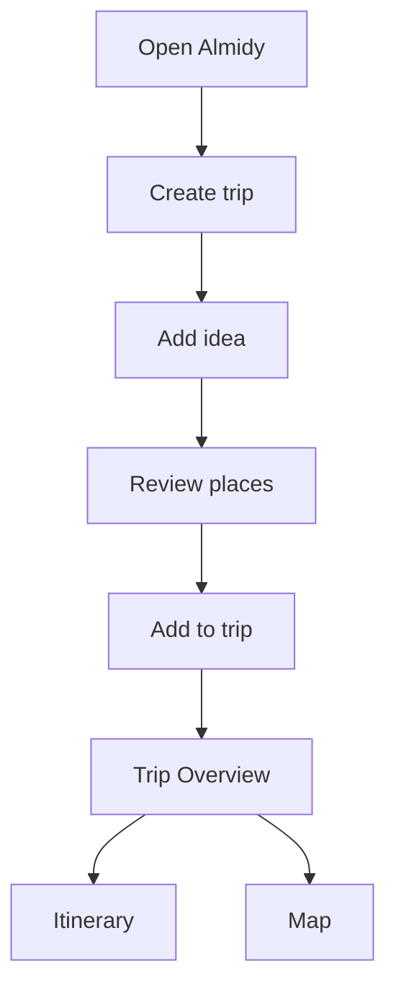
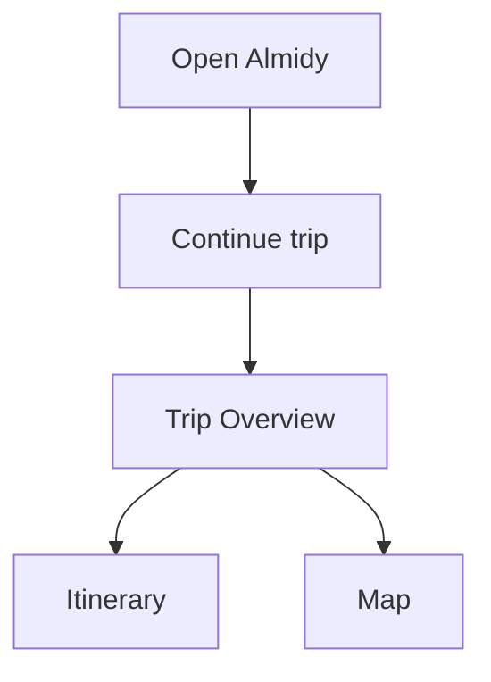
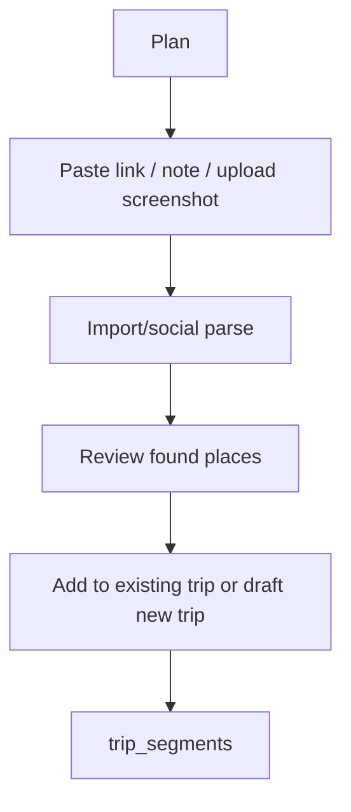
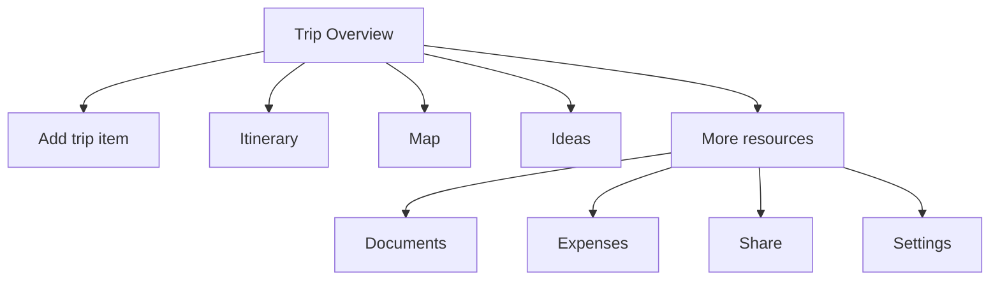
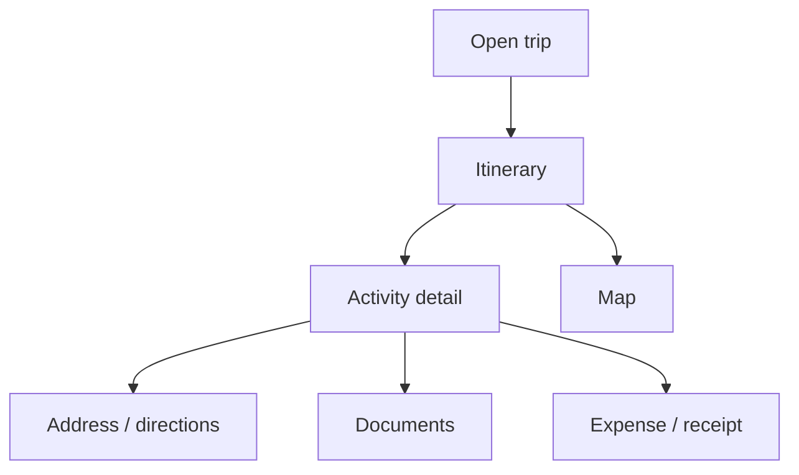
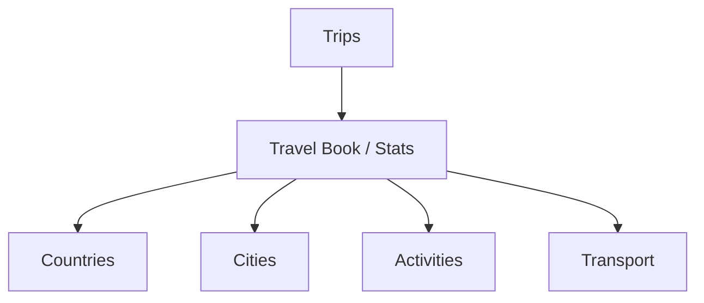
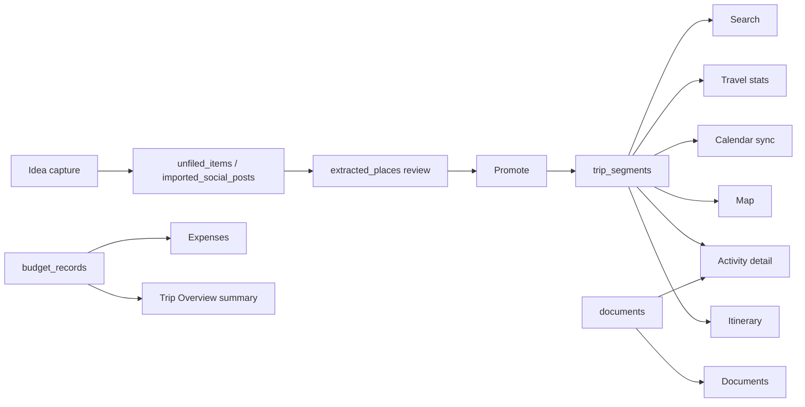

# Almidy Application Architecture Plan

Last updated: 2026-06-21

## Product Direction

Almidy should feel like a premium mobile travel wallet, not a desktop dashboard or a bundle of disconnected feature pages.

Core product sentence:

> Almidy helps users collect travel ideas, turn them into trip plans, and organize everything into a visual itinerary, map, and travel wallet.

Architecture principle:

> Trips are the product. Ideas feed trips. Trip segments power itinerary, map, route, detail, documents, expenses, stats, and search.

## Current Structure

Top-level mobile architecture currently exists in the shell and route set, but naming is still mixed between dashboard language and travel-wallet language.

Canonical top-level surfaces:

| Surface | Canonical route | Purpose |
| --- | --- | --- |
| Launch | `/dashboard` | Mobile globe launch, continue trip, create/search/add entry points |
| Trips | `/dashboard/trips` | Trip list, My Trips wallet, trip creation |
| Plan | `/dashboard/plan` | Idea capture, imports, review queue |
| Map | `/dashboard/map` | Redirects to latest trip map or empty route-map state |
| Profile | `/dashboard/profile` | User profile shell |
| Travel Book / Stats | `/dashboard/profile/stats` | Travel history, countries, cities, activity stats |
| Search | `/dashboard/search` | Global utility search, not a main tab |

Canonical trip workspace:

| Surface | Canonical route | Purpose |
| --- | --- | --- |
| Trip Overview | `/dashboard/trips/[tripId]` | Summary, next up, previews, resources |
| Itinerary | `/dashboard/trips/[tripId]/timeline` | Timeline generated from `trip_segments` |
| Trip Map | `/dashboard/trips/[tripId]/map` | Map generated from mapped `trip_segments` |
| Ideas | `/dashboard/trips/[tripId]/ideas` | Recommendations, unmapped/idea review, add to plan |
| Documents | `/dashboard/trips/[tripId]/documents` | Trip documents placeholder/current document shell |
| Expenses | `/dashboard/trips/[tripId]/budget` | Budget and spending |
| Share | `/dashboard/trips/[tripId]/share` | Sharing and collaborator controls |

## Navigation Pattern

Expected mobile pattern:

```text
Launch / Dashboard
-> Trips
-> Plan
-> Map
-> Profile
```

Expected in-trip pattern:

```text
Trip Overview
-> Itinerary
-> Map
-> Ideas
-> More
```

More should contain:

```text
Documents
Expenses
Share
Settings
```

Current implementation notes:

- `components/sidebar/nav-data.ts` already encodes the intended main tabs: Trips, Plan, Map, Profile.
- `components/app-shell.tsx` still supports `/dashboard?view=*` compatibility states.
- `components/trip/trip-tabs.tsx` exposes trip workspace tabs and More-like resources.
- Search is implemented as `/dashboard/search`, which is correct as a utility route.
- Travel Book currently routes to `/dashboard/profile/stats`, which is the right ownership area.

Target navigation rules:

1. Mobile launch owns the first-screen experience only.
2. Main mobile tabs are stable: Trips, Plan, Map, Profile.
3. Search is accessible from launch/header/actions, not a tab.
4. A trip has one canonical workspace root: `/dashboard/trips/[tripId]`.
5. Trip subresources use nested routes under that trip.
6. Compatibility routes/query views should redirect or disappear once analytics show they are unused.

## Main User Journeys

### First-Time User



Product expectation:

- The user should never wonder whether to start in Dashboard, Trips, Imports, or Plan.
- The primary first-run path should say: create a trip, add inspiration, review places, see itinerary/map.

### Returning User



Product expectation:

- Continue Trip from launch should route to the trip overview, not a generic dashboard block.
- The overview should answer: what is next, what is missing, what can I do now?

### Planning From Inspiration



Product expectation:

- Plan is the inbox for inspiration.
- Ideas are not itinerary items until promoted.
- Promotion creates or updates `trip_segments`.

### Inside A Trip



Product expectation:

- Trip Overview is the wallet/pass.
- Itinerary and Map are two views of the same `trip_segments`.
- Documents, Expenses, Share, and Settings are supporting resources, not main app tabs.

### Traveler During Trip



Product expectation:

- The travel-day mode should prioritize next item, address, directions, reservation, and supporting document.
- Activity detail sheets should be the consistent way to inspect a trip segment from itinerary or map.

### Post-Trip



Product expectation:

- Travel Book belongs under Trips/Profile.
- It should be an outcome of completed trips and mapped segments, not a separate dashboard feature block.

## Resource Model

### Trip

Primary table: `trips`

Trip is the main container.

Contains:

- title/name
- destination
- start/end dates
- destination photo/provider metadata
- status/travel style/budget
- `trip_segments`
- documents
- expenses
- sharing/settings

Rules:

- Every trip-owned resource must check `user_id` and/or trip ownership server-side.
- Trip Overview should load only the summary data it needs and link to resource-specific pages.

### Trip Segment

Primary table: `trip_segments`

`trip_segments` is the source of truth for itinerary, map, route, travel stats, detail sheets, calendar sync, and location resolution.

Do not bring back `itinerary_items`.

Supported/target segment types:

- Place
- Restaurant
- Activity
- Hotel/Lodging
- Flight
- Transport
- Meeting

Rules:

- Itinerary = ordered/date-grouped `trip_segments`.
- Map = mapped `trip_segments`.
- Activity detail = single `trip_segments` record plus supporting metadata.
- Route-aware items should store route metadata in provider/route metadata, not in a parallel item model.

### Idea

Primary tables today:

- `unfiled_items`
- `imported_social_posts`
- `extracted_places`

Target domain name: `ideas`

Flow:

```text
Idea capture
-> Review
-> Add to trip
-> trip_segment
```

Rules:

- Ideas are not trip items until promoted.
- Review state should be explicit: pending, needs review, ready, promoted, dismissed.
- The UI should call this area Plan/Ideas, not Imports unless the user is specifically connecting an import source.

### Document

Current state:

- `/dashboard/trips/[tripId]/documents` exists.
- Search currently treats document-like data through unfiled/import rows.
- Upload/storage support is intentionally unavailable in UI.

Target resource:

- `trip_documents` or equivalent dedicated document table.

Document supports either:

- trip-level attachment
- segment-level attachment

Examples:

- reservation
- boarding pass
- ticket
- screenshot
- link
- note
- email

Rules:

- Document upload should not be faked through trip notes long-term.
- A document can be attached to a trip segment when it directly supports an activity, flight, hotel, or restaurant.

### Expense

Primary table: `budget_records`

Expense supports trip spending.

Should appear as:

- overview spending summary
- full Expenses page
- linked to trip segment when supported

Rules:

- Overview should show totals and top categories only.
- `/budget` should eventually be renamed or surfaced as Expenses in UI copy.
- Destructive expense actions require confirm flow and ownership checks.

### Search

Canonical route: `/dashboard/search`

Current sources:

- trips
- `trip_segments`
- `extracted_places`
- `unfiled_items`

Target sources:

- trips
- trip segments
- ideas
- documents
- expenses when relevant

Rules:

- Search is global utility.
- Search results should route to canonical surfaces: trip overview, timeline item anchor/detail, idea review item, document detail, expense detail.

## Route Audit

### Canonical Routes

Keep and invest:

- `/dashboard`
- `/dashboard/trips`
- `/dashboard/plan`
- `/dashboard/map`
- `/dashboard/profile`
- `/dashboard/profile/stats`
- `/dashboard/search`
- `/dashboard/account`
- `/dashboard/imports` for import-source management and advanced intake
- `/dashboard/trips/[tripId]`
- `/dashboard/trips/[tripId]/timeline`
- `/dashboard/trips/[tripId]/map`
- `/dashboard/trips/[tripId]/ideas`
- `/dashboard/trips/[tripId]/documents`
- `/dashboard/trips/[tripId]/budget`
- `/dashboard/trips/[tripId]/share`

### Compatibility Aliases

Keep temporarily, redirect or merge later:

- `/dashboard?view=trips`
- `/dashboard?view=imports`
- `/dashboard?view=map`
- `/dashboard?view=account`
- `/dashboard/trips/[tripId]/sharing`
- `/trip/[slug]`

Recommended migrations:

- `/dashboard?view=trips` -> `/dashboard/trips`
- `/dashboard?view=imports` -> `/dashboard/plan` or `/dashboard/imports` depending entry source
- `/dashboard?view=map` -> `/dashboard/map`
- `/dashboard?view=account` -> `/dashboard/profile` or `/dashboard/account`
- `/dashboard/trips/[tripId]/sharing` -> `/dashboard/trips/[tripId]/share`
- `/trip/[slug]` remains public/shared only if it has a clear unauthenticated sharing contract.

### Admin / Internal Routes

Keep out of consumer navigation:

- `/dashboard/admin`
- `/dashboard/admin/import-events/[eventId]`
- `/dashboard/api-transition`
- `/dashboard/layout-simulator`
- `/admin/feedback`
- `/flight-ops`
- `/flight-ops/alerts`
- `/travel-dashboard`

Recommended handling:

- Protect behind admin/internal access.
- Remove from product navigation.
- Consider moving observability/demo tools under `/internal` or `/dashboard/admin`.

### Dead, Duplicated, Or Candidate For Removal

Candidate issues:

- `share` and `sharing` are duplicate trip sharing pages.
- `/dashboard/imports` and `/dashboard/plan` overlap heavily; Plan should be the user-facing intake, Imports should be advanced/source management.
- `/dashboard?view=*` duplicates route-level navigation.
- `/travel-dashboard` sounds like an old prototype route.
- `/dashboard/layout-simulator` should stay internal only.
- Dashboard language should be reduced in UI copy even if route names stay for now.

## What Is Working

- Strong mobile visual direction with globe launch and wallet sheet.
- Clear emerging top-level nav: Trips, Plan, Map, Profile.
- `trip_segments` is already central in itinerary, map, stats, search, calendar, flight, and recommendations code.
- Trip workspace has meaningful surfaces: overview, timeline, map, ideas, documents, expenses, sharing.
- Search already aggregates the right broad domains.
- Action contract map now provides a useful guardrail against inert/no-op dashboard actions.
- Mutating APIs increasingly use server-side auth, ownership checks, schema validation, and CSRF/session guards.

## What Is Not Working

- Route naming still exposes dashboard/prototype language.
- Some resources have duplicate or ambiguous names: budget vs expenses, share vs sharing, plan vs imports, stats vs Travel Book.
- More/resources are split across route tabs and timeline menus instead of one consistent in-trip More model.
- Documents UI exists before a complete document resource model.
- Plan/import/review data model is spread across `unfiled_items`, `imported_social_posts`, and `extracted_places`, which is powerful but conceptually hard to explain.
- `/dashboard?view=*` compatibility states make canonical navigation harder to reason about.
- Some internal/admin/demo routes live beside product routes.

## Remove, Merge, Rename, Simplify

### Remove Or Hide From Product Nav

- Hide `/dashboard/layout-simulator`.
- Hide `/dashboard/api-transition`.
- Hide `/travel-dashboard`.
- Hide `/flight-ops` from consumer Almidy.
- Hide `/dashboard/admin` unless user is admin.

### Merge

- Merge `/dashboard/trips/[tripId]/sharing` into `/dashboard/trips/[tripId]/share`.
- Treat `/dashboard/imports` as advanced source settings under Plan, not a separate main product concept.
- Fold Travel Stats entry points into Profile/Travel Book and Trips history.

### Rename In UI

- Dashboard -> Wallet or Home.
- Budget -> Expenses.
- Imports -> Sources or Reservation Inbox when visible to users.
- Profile Stats -> Travel Book.
- Trip Timeline -> Itinerary.
- Trip Workspace -> Trip Wallet.

### Simplify

- One mobile launch screen.
- One My Trips surface.
- One canonical trip overview.
- One trip item model: `trip_segments`.
- One global search.
- One Share route.

## Target Screen Map

```text
/dashboard
  Launch wallet
  Continue trip
  Search
  Add
  Travel Book shortcut

/dashboard/trips
  My Trips
  Create trip
  Trip cards
  Travel Book entry

/dashboard/plan
  Add idea
  Paste link/note/screenshot
  Review found places
  Add to trip

/dashboard/map
  Latest/current trip map
  Empty state routes to create/add ideas

/dashboard/profile
  Account identity
  Settings entry
  Travel Book entry

/dashboard/profile/stats
  Travel Book
  Countries/cities/activities/transport

/dashboard/search
  Trips
  Trip items
  Ideas
  Documents
  Expenses

/dashboard/trips/[tripId]
  Trip Overview
  Next up
  Itinerary preview
  Map preview
  Ideas preview
  Documents/Expenses/Share entries

/dashboard/trips/[tripId]/timeline
  Itinerary from trip_segments

/dashboard/trips/[tripId]/map
  Map from trip_segments

/dashboard/trips/[tripId]/ideas
  Ideas/recommendations related to this trip

/dashboard/trips/[tripId]/documents
  Trip and segment documents

/dashboard/trips/[tripId]/budget
  Expenses

/dashboard/trips/[tripId]/share
  Share/collaborators
```

## Target Data Flow



## Recommended Architecture For Next Stage

### 1. Route Canonicalization Layer

Create a small route registry for product routes.

Purpose:

- avoid hardcoded route strings scattered across components
- document canonical vs alias routes
- make route renames safer

Suggested home:

- `lib/navigation/routes.ts`

Rules:

- All UI links import from route helpers.
- Aliases redirect at route level where possible.
- Tests assert no new direct links to deprecated routes.

### 2. Domain Modules

Use domain modules as the boundary between UI and persistence.

Suggested structure:

```text
lib/domain/trips
lib/domain/trip-segments
lib/domain/ideas
lib/domain/documents
lib/domain/expenses
lib/domain/search
lib/domain/travel-book
```

Each domain owns:

- route/API schemas
- read model mappers
- mutation helpers
- permission checks
- user-safe errors

### 3. Read Models Per Screen

Continue the loader pattern, but make loaders compose domain read models rather than owning raw data logic forever.

Example:

```text
Trip Overview loader
-> TripSummaryReadModel
-> NextTripSegmentReadModel
-> SpendingSummaryReadModel
-> DocumentPreviewReadModel
```

This keeps UI pages lightweight and prevents every page from re-learning how to query trips and segments.

### 4. One Trip Segment Contract

Define and enforce a single app-level segment shape.

Suggested home:

- `lib/domain/trip-segments/types.ts`
- `lib/domain/trip-segments/mappers.ts`

Required normalized fields:

- id
- tripId
- userId
- type/kind
- title
- start/end
- location
- lat/lng
- locationStatus
- route metadata
- provider metadata
- document/expense linkage hooks

### 5. Plan/Ideas Pipeline

Rename the product mental model to Ideas while keeping technical import names where useful.

Target stages:

```text
Captured
Parsed
Needs Review
Ready
Promoted
Dismissed
```

All UI should describe this as:

- Add idea
- Review places
- Add to trip

Only advanced settings should mention:

- import sources
- workers
- parsing

### 6. More Menu In Trip

Move supporting trip resources under one mental model:

```text
More
  Documents
  Expenses
  Share
  Trip settings
```

On desktop these can remain visible tabs/sidebar links. On mobile they should feel like trip wallet resources, not peer app tabs.

### 7. Action Contracts Stay Required

Keep `lib/dashboard/action-contracts.ts`, but eventually rename it to a product-neutral location:

```text
lib/actions/action-contracts.ts
```

Add a route/action owner field:

- `domain: "trips" | "ideas" | "map" | "profile" | "settings" | "admin"`

This contract should gate:

- navigation-only buttons
- client-state buttons
- authenticated mutations
- external/service actions
- intentionally disabled actions
- destructive actions

## Priority Roadmap

### Slice 1: Canonical Navigation

- Introduce route registry.
- Move UI copy from Dashboard to Wallet/Home where visible.
- Redirect `/dashboard?view=trips` to `/dashboard/trips`.
- Redirect `/dashboard/trips/[tripId]/sharing` to `/dashboard/trips/[tripId]/share`.
- Keep analytics/logging for alias usage before removing.

### Slice 2: Trip Workspace Cleanup

- Make Trip Overview the mandatory continue-trip target.
- Make Itinerary, Map, Ideas, More the only in-trip primary navigation.
- Rename Budget UI to Expenses.
- Put Documents, Expenses, Share, Settings behind More on mobile.

### Slice 3: Ideas Pipeline Cleanup

- Keep `/dashboard/plan` as user-facing Plan/Ideas.
- Move source connection controls behind advanced settings or Plan settings.
- Normalize review statuses and promotion copy.
- Ensure every promoted idea creates/updates a `trip_segments` record.

### Slice 4: Resource Models

- Design and migrate documents into a dedicated document model.
- Link documents to trip or segment.
- Link expenses to trip or segment.
- Add search result targets for document/expense detail.

### Slice 5: Travel Book

- Make `/dashboard/profile/stats` the canonical Travel Book.
- Add Trips entry points to Travel Book.
- Ensure stats derive from trips and `trip_segments`, not separate feature state.

### Slice 6: Internal Route Hygiene

- Move admin/prototype/ops surfaces out of consumer nav.
- Protect admin routes consistently.
- Remove old prototype pages after redirects and tests are stable.

## Decision Records

1. `trip_segments` is the only trip item source of truth.
2. `itinerary_items` should not be restored.
3. Search is a utility, not a main tab.
4. Travel Book belongs under Trips/Profile.
5. Plan is the user-facing idea capture and review flow.
6. Imports are implementation/source settings, not the main user mental model.
7. Documents and Expenses are trip resources.
8. Destructive actions require confirmation, pending state, error UI, auth, ownership, and CSRF/session protection.
9. Compatibility aliases should be temporary and tracked.

## Success Criteria

The next architecture stage is working when:

- A user can explain the app in one sentence.
- The bottom tabs match the product: Trips, Plan, Map, Profile.
- Continue Trip always lands in the trip wallet/overview.
- Itinerary and Map show the same trip items from `trip_segments`.
- Ideas clearly become trip segments through review/promote.
- Documents and Expenses live under the trip, not as disconnected pages.
- Search finds the major resources and routes to canonical destinations.
- No route has two active names unless one is an explicit compatibility alias.
- No consumer-facing route feels like an admin/prototype/dashboard artifact.
